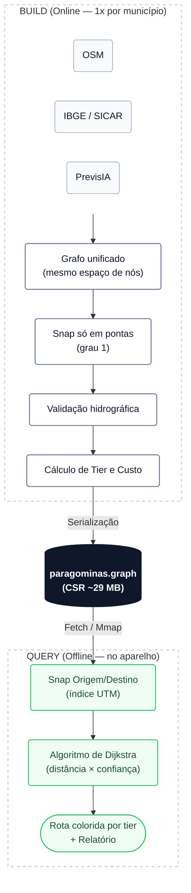

# Roteamento em estradas não mapeadas da Amazônia

Solução para o **Desafio 3** do AmazôniaHack 4.0: roteamento **offline** sobre a
malha viária não oficial de Paragominas (PA) — vias que não aparecem no Google Maps
nem na cartografia oficial, detectadas pelo PrevisIA a partir de imagens Sentinel-2.

## O problema

O PrevisIA entrega traços de estrada extraídos por sensoriamento remoto, mas **um
traço não é um grafo**: linhas que se cruzam na tela não necessariamente compartilham
um vértice, e a malha crua se parte em 1.874 componentes desconexos. Sem topologia não
há rota. O desafio é (1) construir essa conectividade, (2) medir o quanto dela é
confiável e (3) rotear em cima disso — tudo offline, para um agente de fiscalização em
campo sem sinal.

## Abordagem

1. **Construir o grafo** — unir OSM + malha IBGE/SICAR + PrevisIA num mesmo espaço de
   nós; conectar apenas extremidades soltas (grau 1) dentro de uma tolerância
   geométrica, nunca vértices internos (evita "inventar pontes que não existem").
2. **Atribuir confiança por trecho** — cada aresta tem uma origem (OSM, IBGE,
   PrevisIA, ponte) e um multiplicador de custo. Pontes que cruzam rio sem passagem
   conhecida são **excluídas** do grafo (não apenas penalizadas) — é o "erro mais
   caro" do enunciado.
3. **Roteamento** — Dijkstra ponderado por distância real × multiplicador de
   confiança.
4. **Entregar offline** — o grafo final é serializado num binário compacto (CSR) e um
   roteador embarcado (JS, sem dependências) roda no navegador/aparelho sem rede.

## Resultado

| Métrica | Resultado |
|---|---|
| Pares alcançáveis — malha completa | **11 / 16** |
| Pares alcançáveis — sem travessias de rio | **11 / 16** (sem perda) |
| Pares confirmados por segunda fonte (CAR) | **1 / 16** |

O teto relatado no enunciado (só OSM + PrevisIA) era 9–10/16; incorporar a malha do
IBGE e validar contra a hidrografia oficial sobe para 11/16 — mas apenas 1 deles tem
confirmação independente por infraestrutura declarada no CAR. Essa lacuna entre
"geometricamente plausível" e "confirmado por segunda fonte" é o número mais honesto
que temos. Análise completa em [`desafio3_avaliacao.md`](desafio3_avaliacao.md).

## Arquitetura



O trabalho pesado é **preparação**, feita uma vez; o que roda em campo é um grafo
estático de ~29 MB e um Dijkstra que resolve uma rota em dezenas de ms.

## Arquivos

| Arquivo | O quê |
|---|---|
| `desafio3_grafo_base.py` | Pipeline de construção (Python): grafo, snap, validação, serialização |
| `desafio3_grafo_schema.md` | Especificação do formato binário do grafo |
| `offline/router.js` | Roteador offline (biblioteca JS, sem dependências) |
| `offline/index.html` | Demo no navegador: malha colorida por tier + rota por clique |
| `desafio3_avaliacao.md` | Avaliação técnica e de confiabilidade |
| `requirements.txt` | Dependências do pipeline (Python 3.11) |

## Como rodar

### 1. Pipeline de construção (gera o grafo)

```bash
python -m venv .venv && .\.venv\Scripts\Activate.ps1   # Windows
pip install -r requirements.txt
python desafio3_grafo_base.py
```

Gera `paragominas.graph` e as rotas. As **entradas** (não redistribuídas aqui, por
regra do desafio) são: as camadas de estradas OSM e PrevisIA do pacote do desafio, a
malha viária e a drenagem oficiais (WFS público de SEMAS-PA/SICAR) e as pontes já
mapeadas (Overpass/OSM).

### 2. Demo offline (navegador)

```bash
python -m http.server 8000
# abrir http://localhost:8000/offline/
```

Clique na origem, depois no destino; arraste para mover e use a roda do mouse para
zoom. Nenhuma chamada externa em tempo de execução.

O roteador também funciona como CLI (Node), lendo um arquivo de pares no formato
`[id, origem_lon, origem_lat, destino_lon, destino_lat]`:

```bash
node offline/router.js <pares.json>
```

## Fontes de dados (todas abertas)

OpenStreetMap (ODbL) · Imazon/PrevisIA (Sentinel-2) · SICAR/IBGE (WFS) · SIGERH-PA
(WFS) · infraestrutura declarada no CAR (WFS).

## Custo

Custo marginal por rota **zero**: geoprocessamento clássico (NetworkX, Shapely,
GeoPandas, SciPy, PyProj) e um roteador embarcado em JS — nenhuma chamada a modelo de
linguagem ou visão em nenhuma etapa.

## Limitações

- Os 5 pares sem rota não foram investigados caso a caso (isolamento real vs. limite
  do método de snap).
- Sem modelagem de declividade / passabilidade sazonal (Copernicus DEM/SRTM).
- Data da malha PrevisIA desconhecida — declarada como `null`, não estimada.
- Marco bônus ("rede que melhora com o uso") arquitetado, não implementado: um traço
  de GPS validado em campo viraria uma aresta `gps_confirmed` (data + confiança alta)
  no grafo, sem reescrever o roteador.
